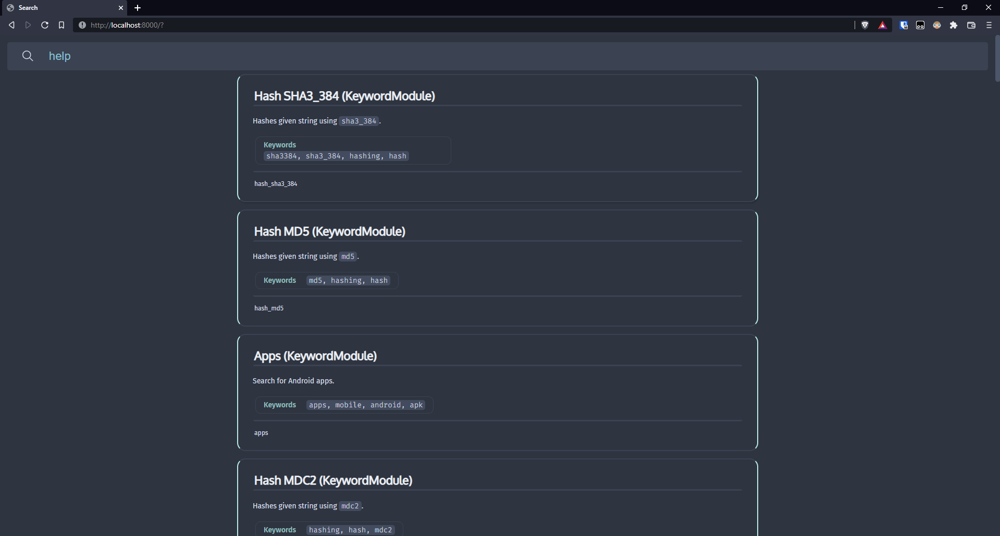

# Search

Fast, asynchronous and modular search system.

Websockets interface preview

## Interface options
- `term`: Mainly for debugging
- `websocket`: Search through a web browser, using ui provided in [web](./web/) directory
- `discord`: Search using discord bot slash commands

## Installation (websockets)
1. Install requirements (`discord-py-slash-command` is not needed)
2. Create `config.ini` similar to [this one](/config.example.ini) (you can skip the `[discord]` section)
3. Copy files from [web](./web/) for example to `/var/www/search`
4. Create a nginx config similar to [this one](/nginx.example.conf)
5. Create a service or chron job that executes `python3 main.py websocket`

## Installation (discord)
1. Install requirements (`websockets` is not needed)
2. Create `config.ini` similar to [this one](/config.example.ini) (you can skip the `[websocket]` section)
3. Create a service or chron job that executes `python3 main.py discord`

## Avaliable search modules
<!--modules-->
- **Apps**:
	- Search for Android apps.
	- Keywords: ` mobile `, ` android `, ` apps `, ` apk `
- **Base64 Decode**:
	- Decode ASCII string using the standard Base64 alphabet.
- **Base64 Encode**:
	- Encode ASCII string using the standard Base64 alphabet.
	- Keywords: ` b64 `, ` b64encode `, ` base64 `
- **Bins**:
	- Return gists.
	- Keywords: ` bin `, ` pastebin `, ` pastes `, ` bins `, ` gist `, ` text `, ` txt `, ` texts `, ` paste `
- **Duck answers**:
	- Retrieve instant answers from duck duck go.
- **Ebooks**:
	- Search for ebooks using `r/Piracy` cse.
	- Keywords: ` pdf `, ` book `, ` ebook `, ` reading `, ` books `, ` ebooks `
- **Email**:
	- Display info about an email.
- **Ethereum**:
	- Display info about an ethereum address.
- **Files**:
	- Search for files
	- Keywords: ` dl `, ` files `, ` file `, ` download `
- **Games**:
	- Search for game cracks.
	- Keywords: ` games `, ` cracks `, ` game `, ` steam `, ` crack `, ` videogames `
- **Google**:
	- Searches using Google.
- **Google Drive**:
	- Search for files in google drive
	- Keywords: ` files `, ` file `, ` download `, ` drive `
- **Hash BLAKE2B**:
	- Hashes given string using `blake2b`.
	- Keywords: ` hash `, ` blake2b `, ` hashing `
- **Hash BLAKE2S**:
	- Hashes given string using `blake2s`.
	- Keywords: ` blake2s `, ` hashing `, ` hash `
- **Hash MD4**:
	- Hashes given string using `md4`.
	- Keywords: ` hash `, ` hashing `, ` md4 `
- **Hash MD5**:
	- Hashes given string using `md5`.
	- Keywords: ` hash `, ` hashing `, ` md5 `
- **Hash MD5-SHA1**:
	- Hashes given string using `md5-sha1`.
	- Keywords: ` hash `, ` hashing `, ` md5-sha1 `
- **Hash MDC2**:
	- Hashes given string using `mdc2`.
	- Keywords: ` hash `, ` hashing `, ` mdc2 `
- **Hash RIPEMD160**:
	- Hashes given string using `ripemd160`.
	- Keywords: ` hash `, ` hashing `, ` ripemd160 `
- **Hash SHA1**:
	- Hashes given string using `sha1`.
	- Keywords: ` hash `, ` hashing `, ` sha1 `
- **Hash SHA224**:
	- Hashes given string using `sha224`.
	- Keywords: ` sha224 `, ` hashing `, ` hash `
- **Hash SHA256**:
	- Hashes given string using `sha256`.
	- Keywords: ` hash `, ` hashing `, ` sha256 `
- **Hash SHA384**:
	- Hashes given string using `sha384`.
	- Keywords: ` hash `, ` sha384 `, ` hashing `
- **Hash SHA3_224**:
	- Hashes given string using `sha3_224`.
	- Keywords: ` hash `, ` hashing `, ` sha3224 `, ` sha3_224 `
- **Hash SHA3_256**:
	- Hashes given string using `sha3_256`.
	- Keywords: ` hash `, ` hashing `, ` sha3256 `, ` sha3_256 `
- **Hash SHA3_384**:
	- Hashes given string using `sha3_384`.
	- Keywords: ` hash `, ` hashing `, ` sha3_384 `, ` sha3384 `
- **Hash SHA3_512**:
	- Hashes given string using `sha3_512`.
	- Keywords: ` hash `, ` hashing `, ` sha3_512 `, ` sha3512 `
- **Hash SHA512**:
	- Hashes given string using `sha512`.
	- Keywords: ` hash `, ` sha512 `, ` hashing `
- **Hash SHA512_224**:
	- Hashes given string using `sha512_224`.
	- Keywords: ` hash `, ` hashing `, ` sha512224 `, ` sha512_224 `
- **Hash SHA512_256**:
	- Hashes given string using `sha512_256`.
	- Keywords: ` hash `, ` sha512_256 `, ` hashing `, ` sha512256 `
- **Hash SHAKE_128**:
	- Hashes given string using `shake_128`.
	- Keywords: ` hash `, ` hashing `, ` shake128 `, ` shake_128 `
- **Hash SHAKE_256**:
	- Hashes given string using `shake_256`.
	- Keywords: ` hash `, ` shake_256 `, ` hashing `, ` shake256 `
- **Hash SM3**:
	- Hashes given string using `sm3`.
	- Keywords: ` sm3 `, ` hashing `, ` hash `
- **Hash WHIRLPOOL**:
	- Hashes given string using `whirlpool`.
	- Keywords: ` hash `, ` whirlpool `, ` hashing `
- **Help**:
	- Search through modules.
	- Keywords: ` modules `, ` help `, ` features `, ` module `
- **IP**:
	- Gets ip addresses.
	- Keywords: ` ipv4 `, ` ipv6 `, ` ip `
- **Length**:
	- Get length of a string.
	- Keywords: ` len `, ` length `
- **Rainbowtables**:
	- Uses online APIs to *try* cracking a password hash.
	- Keywords: ` rainbowtables `, ` dehash `, ` rainbow `, ` rainbowtable `
- **Regex**:
	- Displays regex visualization.
- **Roms**:
	- Search for console roms.
	- Keywords: ` games `, ` consoles `, ` roms `, ` nintendo `, ` emulation `
- **Service**:
	- Display info about services running.
- **UserAgent**:
	- Returns your and random useragent.
	- Keywords: ` useragent `, ` user agent `, ` ua `, ` brand `
- **Wolfram Alpha**:
	- Query Wolfram|Alpha.

<!--modules-->